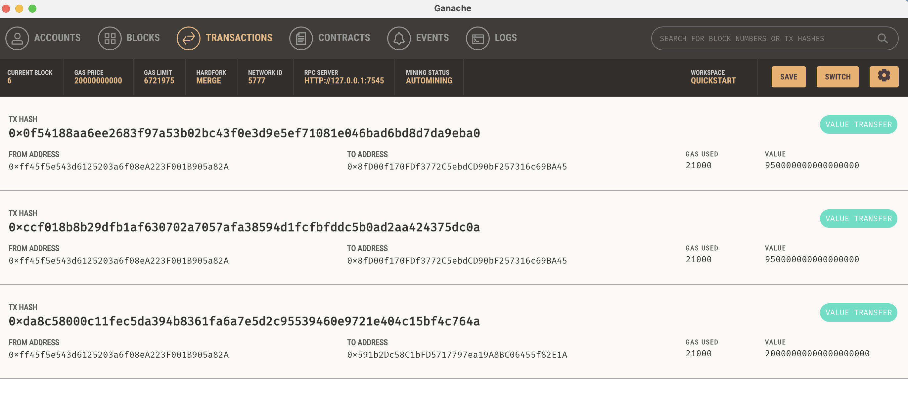

## Unit 19 Homework: Cryptocurrency Wallet

## Background

**2 files:**
1. `krypto_jobs.py` contains the code associated with the web interface of the application. The code included in this file is compatible with the Streamlit library. All code written for this Challenge is in this file.
2. `crypto_wallet.py` contains the Ethereum transaction functions that we have created throughout this module’s lessons. By using import statements, I integrated the `crypto_wallet.py` Python script into the KryptoJobs2Go interface program that is found in the `krypto_jobs.py` file.

Integrating these two files allows us to automate the tasks associated with generating a digital wallet, accessing Ethereum account balances, and signing and sending transactions via a personal Ethereum blockchain called Ganache.

## Inspect the Transaction

A test transaction was completed using the application’s web interface. The resulting transaction was then looked up in Ganache. Please see images below:

**Overview of Streamlit Interface**

**Adress Balance and History on Ganache**

**Transaction Details on Ganache**

**Validated Transaction**

Final requirement includes: "Return to the original transaction, and click the transaction’s To address. Take a screenshot of the recipient’s address balance and history from your Ganache application." Clicking on the "to address" or searching the address is not possible to see the recipient's (in this case Jo's) address balance and history on Ganache. 
